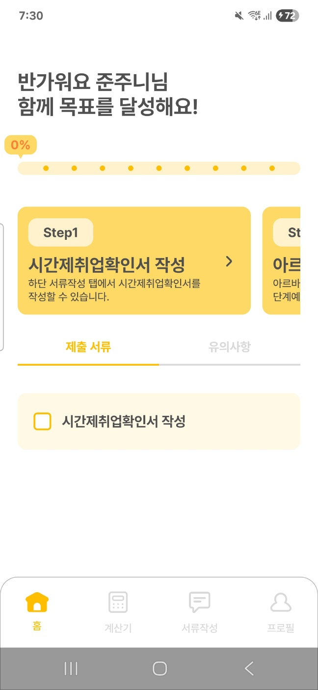
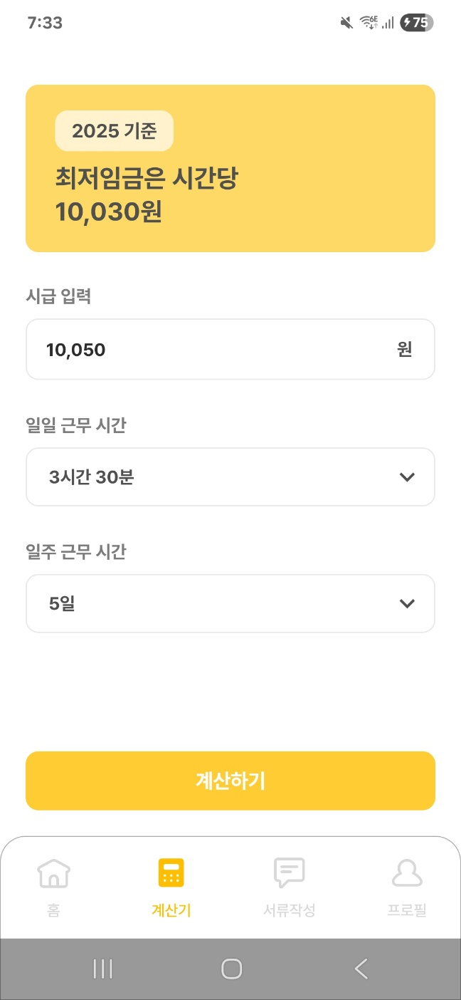
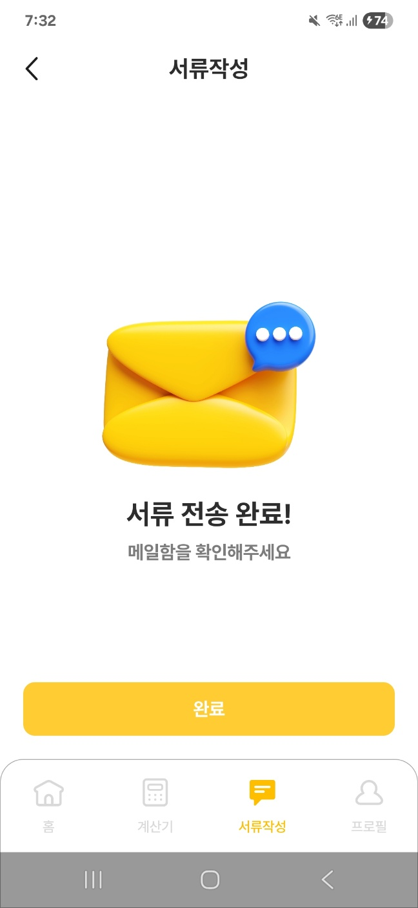
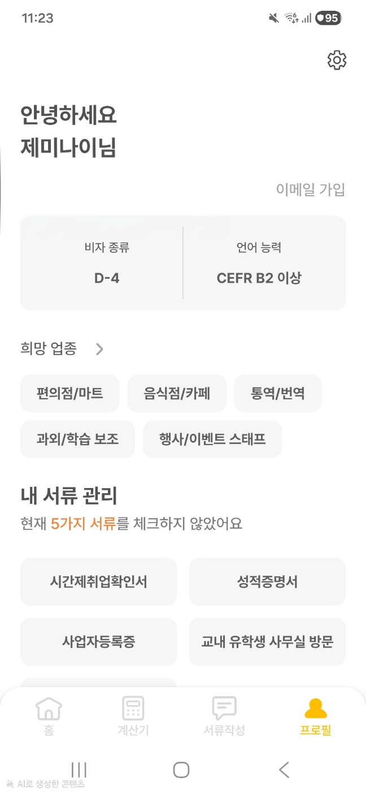

# CHECKMATE - 외국인 유학생 시간제 취업 지원 앱

<p align="center">
  
</p>

<p align="center">
  
  
  
  
</p>

<p align="center">
  <a href="https://play.google.com/store/apps/details?id=unithon.helpjob">
    
  </a>
  <a href="https://apps.apple.com/kr/app/checkmate-%EC%9C%A0%ED%95%99%EC%83%9D-%EC%B7%A8%EC%97%85-%EB%B9%84%EC%84%9C/id6756861914">
    
  </a>
</p>

## 프로젝트 소개

외국인 유학생이 한국에서 시간제 취업을 하려면 복잡한 행정 절차를 거쳐야 합니다. 어떤 서류가 필요한지, 양식은 어떻게 작성하는지, 급여는 제대로 받고 있는지 — 한국어가 익숙하지 않은 유학생에게는 큰 장벽입니다.

**CHECKMATE**는 교내 연합 해커톤 유니톤 우승작을 기반으로, 실제 서비스까지 발전시킨 크로스플랫폼 앱입니다. 체크리스트, 서류 자동 작성, 급여 계산기로 원스톱 지원하며, Kotlin Multiplatform으로 Android/iOS **양 스토어 출시**를 달성하고 **94% 코드 공유율**을 유지하고 있습니다.

## 스크린샷

<p align="center">
  
  
  
  
</p>

## 주요 기능

- **취업 체크리스트** — 단계별 가이드로 필요 서류와 절차를 안내
- **시간제취업확인서 자동 작성** — 반려 없이 정확한 양식으로 작성 후 이메일 발송
- **급여 계산기** — 최저임금 기준 예상 급여 계산
- **다국어 지원** — 한국어 / 영어
- **Guest Mode** — 회원가입 없이 핵심 기능 체험

## 기술적 성과

**94%** 크로스플랫폼 코드 공유율 (commonMain 기준, Android/iOS 간 공유)

## 기술 스택

| 분류 | 기술 |
|------|------|
| Language | Kotlin |
| Architecture | MVVM, 2-Layer (Data + UI) |
| UI | Compose Multiplatform |
| Network | Ktor Client |
| DI | Koin |
| Local Storage | DataStore |
| Resources | Compose Multiplatform Resources |
| Analytics | Firebase Analytics |
| Build | Gradle (KTS), BuildKonfig |

## 아키텍처

MVVM 2계층 구조를 채택하고, 불필요한 도메인 계층(UseCase 등)을 배제하여 복잡성을 최소화했습니다. expect/actual 패턴으로 플랫폼별 구현을 분리합니다.

```
composeApp/
├── commonMain/    (94% - 공유 코드)
│   ├── data/      (Repository, Network, Model)
│   ├── ui/        (Screen + ViewModel)
│   └── di/        (Koin 공통 모듈)
├── androidMain/   (Android 전용)
└── iosMain/       (iOS 전용)
```

## 개발 과정 & 회고

### architecture-samples 기반 Android 앱 → KMP 전체 마이그레이션

초기에 Google의 [architecture-samples](https://github.com/android/architecture-samples)를 토대로 Navigation, NavGraph, DI 모듈 구성 등 앱의 기본 아키텍처를 설계했고, 이후 [Now in Android](https://github.com/android/nowinandroid)를 참고하여 하단 네비게이션 등 UI 구성을 보완했습니다. 이후 iOS 동시 출시가 필요해지면서 Kotlin Multiplatform으로 전체 마이그레이션을 결정했고, 기술 스택을 전면 전환했습니다.

- Retrofit → **Ktor Client** (suspend 네이티브 지원)
- Hilt → **Koin** (KMP 호환)
- XML String Resources → **Compose Multiplatform Resources** (크로스플랫폼 리소스)

### Ktor 전환 시 이메일 검증 장애 해결

Retrofit에서 Ktor로 전환 후 이메일 중복 검사가 동작하지 않는 이슈가 발생했습니다. Retrofit은 HTTP 400 응답을 Exception으로 throw하지만, Ktor는 기본적으로 정상 응답으로 처리하는 차이가 원인이었습니다. `expectSuccess` 설정을 통해 해결했으며, 라이브러리 전환 시 **동작 방식의 차이를 반드시 파악해야 한다**는 교훈을 얻었습니다.

### 리소스 시스템: Moko → Compose Multiplatform Resources 교정

KMP 리소스 관리를 위해 처음에 Moko Resources(서드파티 라이브러리)를 채택했으나, JetBrains 공식 Compose Multiplatform Resources가 이미 Stable(1.6.0+)인 것을 확인하고 3일 만에 공식 솔루션으로 전환했습니다. **서드파티보다 공식 문서 패턴을 우선**하는 원칙을 실천한 사례입니다.

### 에러 처리 체계 구축

프로젝트 초기에는 에러 처리가 전혀 없어 크래시가 그대로 발생했습니다. 단계적으로 개선했습니다.

1. `CoroutineExceptionHandler` + `UncaughtExceptionHandler` 도입으로 크래시 방지
2. `launch` 등 비동기 코드에 try-catch 적용
3. `BaseViewModel` 추상화로 일관된 패턴 적용 — **사용자에게 알려야 할 에러는 UI에 표시하고, 내부 실패는 로깅만 수행**하는 원칙을 정립

### 컴포넌트 추상화 설계

UI 컴포넌트를 계층적으로 설계했습니다. `BaseButton` → `PrimaryButton` / `SecondaryButton` 같은 구조로 공통 스타일을 관리하면서, **모든 UI를 무조건 컴포넌트화하지 않고** 재사용 빈도와 복잡도를 기준으로 판단하여 불필요한 추상화를 배제했습니다.

### Apple 심사 대응 — Guest Mode & Batch API

App Store Guideline 5.1.1(개인정보 수집) 관련 거절에 대응하여, 회원가입 없이도 앱의 핵심 기능을 체험할 수 있는 Guest Mode를 구현했습니다. 게스트에서 회원으로 전환 시 로컬 데이터를 서버에 동기화하는 과정을 Batch API로 처리하여 효율적인 데이터 전환을 구현했습니다.
